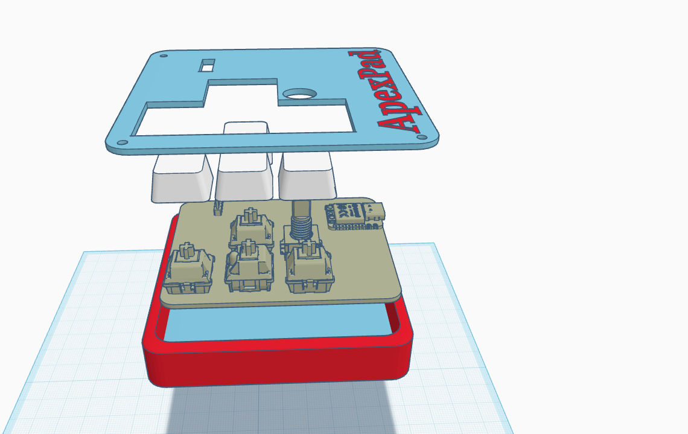
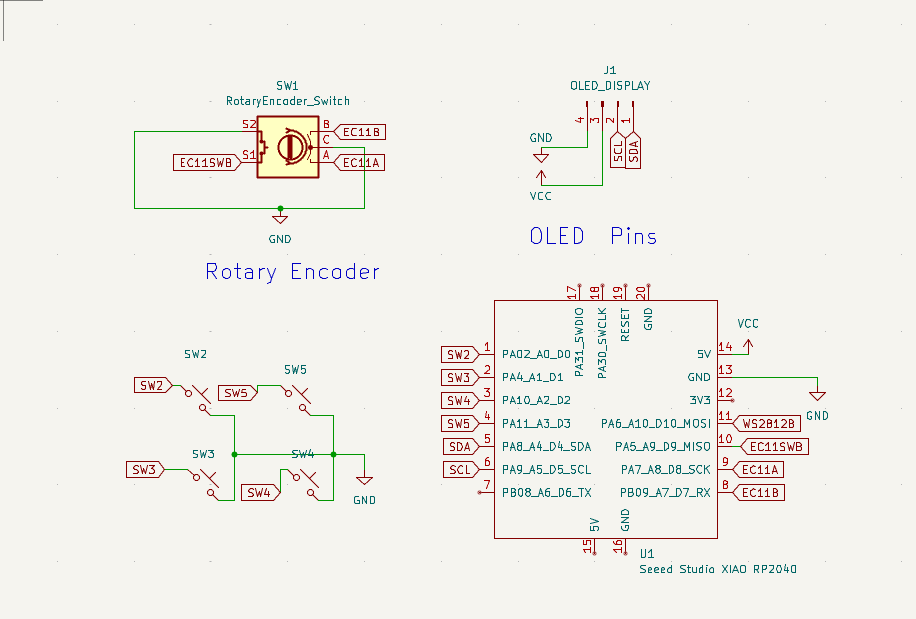
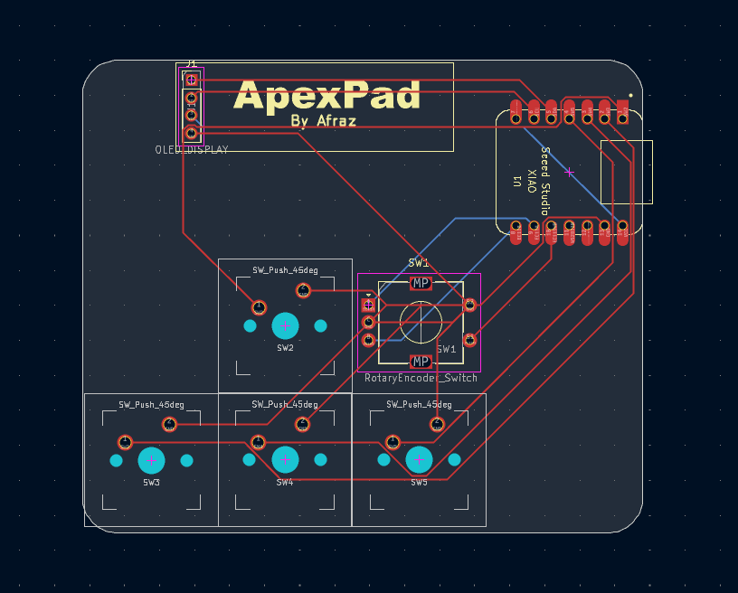

# ApexPad

***ApexPad*** is a *minimal* 4-key + encoder **HackPad** mainly designed for **video editing**. It features an OLED display and uses the **QMK Firmware Framework**.

---

## Features

* OLED display with startup animations and more
* 2-part case
* Pookie-sized
* 4 macro keys
* Rotary encoder for volume control
* QMK-powered firmware
* Compact PCB design

---

## CAD Model

Made in **Tinkercad**. I got tired of fighting with Fusion 360 and switched to Tinkercad. 

---

## PCB

### Schematic

### PCB Layout

---

## Firmware Overview

This HackPad uses **QMK Firmware**.

| Control        | Function                              |
| -------------- | ------------------------------------- |
| **SW1**        | Copy (`Ctrl+C`)                       |
| **SW2**        | Paste (`Ctrl+V`)                      |
| **SW3**        | Undo (`Ctrl+Z`)                       |
| **SW4**        | Split (`Ctrl+B`, assigned for CapCut) |
| **Encoder SW** | Redo (`Ctrl+Shift+Z`)                 |
| **Encoder**    | Volume Up / Down                      |

And that's it. I might add something else later. 👀

---

## BOM

Everything you need to build this HackPad:

| Quantity | Component                    |
| -------: | ---------------------------- |
|       1× | Seeed Studio XIAO RP2040     |
|       4× | DSA keycaps                  |
|       4× | MX-style mechanical switches |
|       1× | 0.91" 128×32 OLED display    |
|       1× | EC11 rotary encoder          |
|       8× | M3 screws                    |
|       8× | M3 heat-set inserts          |
|       1× | 2-part printed case          |

---

## Software

* **QMK Firmware**
* **Tinkercad** for the CAD model
* **KiCad** for PCB design

## Hardware

* Seeed Studio XIAO RP2040
* 4× mechanical switches
* EC11 rotary encoder
* 0.91" 128×32 SSD1306 OLED
* Custom PCB
* Custom 2-part 3D-printed case
